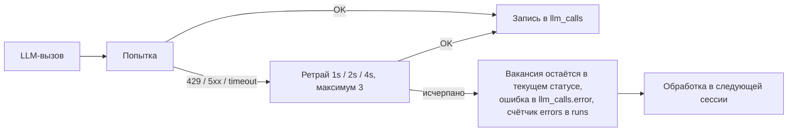

# AI Specification

**Версия**: 1.0
**Дата**: 2026-07-03
**Автор**: @aleksandr (при участии Claude)

---

## Модели

| Назначение | Провайдер | Модель | Роль |
|---|---|---|---|
| Скоринг вакансий | Anthropic | claude-sonnet-5 | Primary |
| Генерация писем | Anthropic | claude-sonnet-5 | Primary |
| Рисерч компаний | Perplexity | sonar | Primary |
| Рисерч (сложные случаи) | Perplexity | sonar-pro | По флагу в конфиге |

Fallback-провайдера нет: при недоступности API вакансия остаётся в текущем статусе
и обрабатывается в следующей сессии (пропуск сессии дешевле неверного отклика).

---

## Промпты

Хранятся в git: `src/llm/prompts/{purpose}-v{N}.ts`. Активная версия — в конфиге.
Старые версии не удаляются. При смене версии — прогон на эталонном наборе (см. Evals).

### Скоринг (`scoring-v1`)

**Вход**: резюме (`master.md`), полный текст вакансии, требования из конфига (зарплатные ожидания, формат работы).
**Выход** — строго JSON:

```json
{
  "score": 0-100,
  "reasons": ["почему подходит, 2-4 пункта"],
  "red_flags": ["риски и несоответствия"],
  "salary_match": "match | below | unknown",
  "seniority_match": "match | stretch | overqualified | underqualified"
}
```

**Ключевые инструкции промпта**:
- Оценивать пересечение реального опыта из резюме с обязанностями вакансии, а не совпадение ключевых слов
- `stretch` по опыту (просят 3–6 лет) не занижает score, если стек совпадает
- Жёстко штрафовать: аутстафф/галеры без продукта, вакансии-заглушки агентств, чистый DS/CV без LLM-составляющей
- Порог прохождения: **65** (настраивается в конфиге)

### Рисерч компании (`research-v1`, Perplexity)

**Вход**: название компании, employer_id, город, домен (если есть).
**Выход**: markdown-справка ≤ 300 слов: продукт и бизнес-модель; технологический стек и зрелость ИИ-направления; свежие новости (6 мес); репутация как работодателя; 1–2 зацепки для персонализации письма.

### Письмо (`letter-v1`)

**Вход**: резюме, вакансия, справка о компании, score_reasons.
**Выход**: текст письма 120–180 слов, русский язык.

**Ключевые инструкции промпта**:
- Официальный тон, **от лица ИИ-агента**: письмо начинается с представления — агент действует по поручению Александра Доронина и прозрачно сообщает об этом
- Сама форма отклика — демонстрация компетенций кандидата (агентные системы, MCP, LLM)
- 2–3 конкретных пересечения опыта кандидата с вакансией, 1 зацепка из справки о компании
- Запрещено: выдумывать факты, которых нет в резюме или справке; канцелярские штампы; обещания от имени кандидата (зарплата, сроки выхода)
- Подпись: контакты Александра из резюме

---

## Параметры генерации

| Вызов | temperature | max_tokens | Формат |
|---|---|---|---|
| Скоринг | 0.2 | 1024 | JSON (валидация схемы, 1 повтор при невалидном) |
| Рисерч | по умолчанию провайдера | 1024 | Markdown |
| Письмо | 0.6 | 1024 | Текст |

---

## Кэширование

- Справка о компании — таблица `companies`, TTL 30 дней (компании повторяются между вакансиями)
- Скоринг и письма не кэшируются — всегда уникальны для вакансии
- Prompt caching Anthropic: резюме и системный промпт помечаются `cache_control` — резюме одинаково во всех вызовах сессии

---

## Стратегия отказов



- Timeout одного запроса: 60 с
- Невалидный JSON скоринга: 1 повторный запрос с указанием на ошибку; после — `failed`
- 5 LLM-ошибок за сессию → сессия останавливается (`stop_reason = error_streak`)

---

## Логирование (требование FR-013)

Каждый вызов — строка в `llm_calls`: провайдер, назначение, модель, полный запрос
и ответ (JSON), токены, стоимость, латентность, привязка к вакансии и запуску.
Это даёт: отладку промптов на реальных данных, точный учёт затрат, воспроизводимость
каждого решения агента. API-ключи в лог не попадают.

---

## Оценка качества (Evals)

### Период калибровки (первая неделя, dry-run)

| Метрика | Цель | Способ |
|---|---|---|
| Согласие с решением скоринга | ≥ 85% | Александр размечает решения агента по ~50 вакансиям через `get_queue` |
| Письма без правок | ≥ 8 из 10 | Ручной просмотр писем в dry-run |
| Галлюцинации в письмах | 0 | Проверка каждого факта письма против резюме и справки |
| Ложный пропуск сильных вакансий | ≤ 1 из 20 | Просмотр отсеянных со score 50–64 |

По итогам калибровки корректируются порог и промпты, фиксируется версия — и только
после этого включается live-режим.

### Постоянный контроль

- Дневной отчёт: распределение score, затраты, доля ошибок
- Раз в неделю: выборочная проверка 5 отправленных писем

---

## Стоимость и лимиты

Оценка на день при лимите 10 откликов (≈40 скорингов, ≈8 рисерчей с учётом кэша, 10 писем):

| Статья | Оценка/день |
|---|---|
| Скоринг (40 × ~4K вход с кэшем резюме) | ~$0.5 |
| Письма (10 × ~5K вход / 0.3K выход) | ~$0.25 |
| Perplexity sonar (8 запросов) | ~$0.1 |
| **Итого** | **≤ $1/день, ≤ $30/мес** |

Бюджет из PRD: $50/мес. Факт считается из `llm_calls.cost_usd`; цены моделей — в конфиге
(проверить актуальные тарифы при реализации). Дневной отчёт включает затраты; при
превышении $2.5/день — предупреждение в отчёте.

---

## Безопасность промптов

- [ ] Текст вакансии и справка компании — недоверенные данные: в промптах явно помечены как контент для анализа, инструкции внутри них игнорируются (защита от промпт-инъекций в вакансиях)
- [ ] Письмо перед отправкой проходит программную проверку: длина 120–180 слов, нет URL, кроме разрешённых (tedo.ru, github), есть подпись
- [ ] Ключи только в `.env`, в `llm_calls.request` маскируются
- [ ] Резюме — единственный источник фактов о кандидате

---

## История изменений

| Дата | Версия | Автор | Что изменилось |
|---|---|---|---|
| 2026-07-03 | 1.0 | @aleksandr | Первая версия: три вызова, промпты v1, план калибровки |
