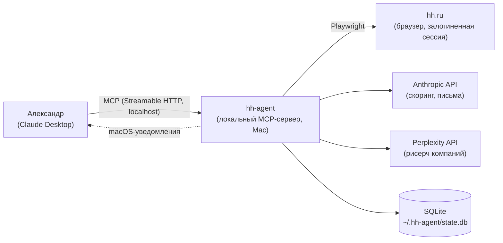
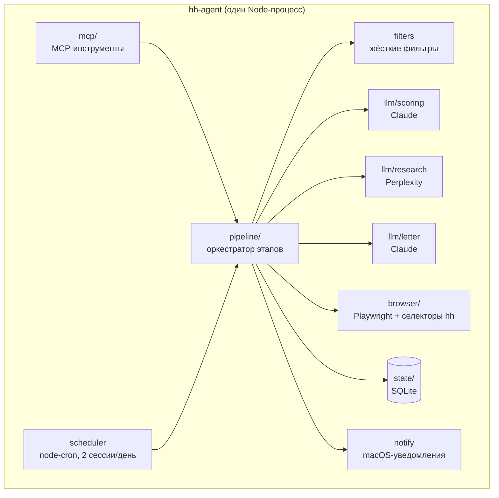
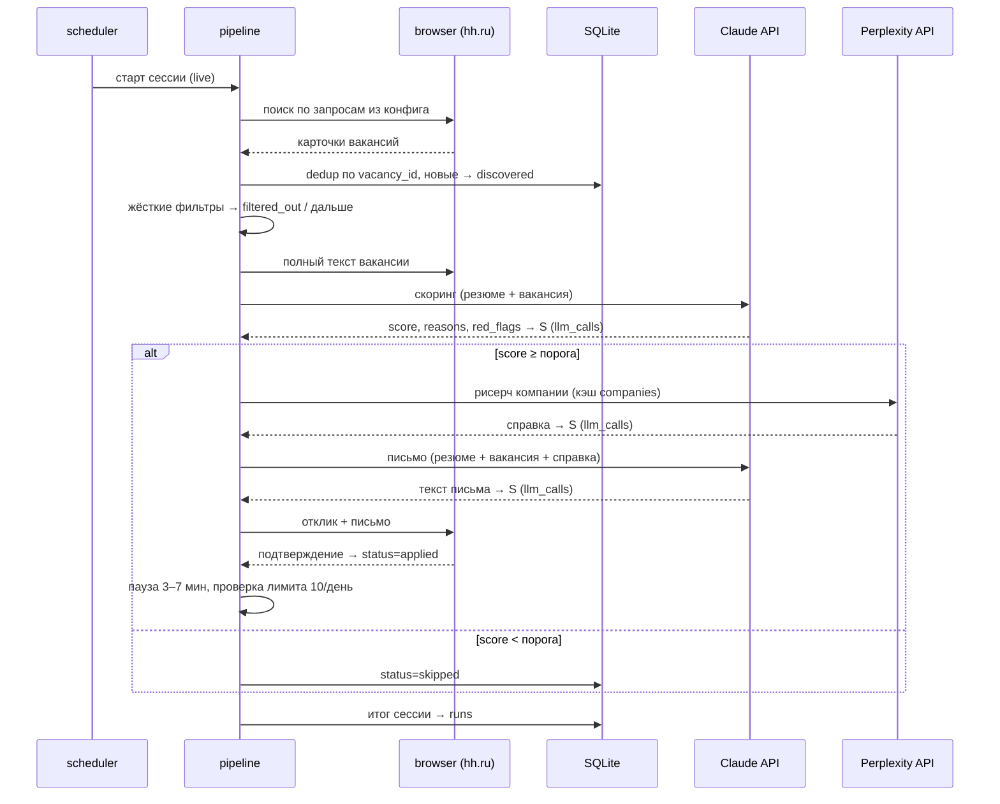
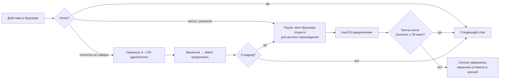

# Architecture Overview

**Версия**: 1.0
**Дата**: 2026-07-03
**Автор**: @aleksandr (при участии Claude)

---

## Контекст системы (C4 Level 1)

**Пользователь**: Александр — управляет агентом из Claude Desktop через MCP-инструменты; получает уведомления при проблемах.
**Внешние системы**: hh.ru (через браузер, не через API — см. [ADR-001](./adr/001-канал-откликов.md)), Anthropic API, Perplexity API.

---

## Компоненты (C4 Level 2)

### mcp/
- **Стек**: `@modelcontextprotocol/sdk`, Streamable HTTP транспорт на `localhost:<порт из конфига>`
- **Процесс**: постоянный, автозапуск через launchd при логине; Claude Desktop подключается как к remote-серверу — автопилот не зависит от того, открыт ли Desktop, экземпляр всегда один
- **Роль**: интерфейс управления из Claude Desktop: `status`, `run_now`, `pause`, `resume`, `get_report`, `get_queue`, `get_vacancy`, `set_filters`, `blacklist_add`, `blacklist_remove`, `dry_run`
- **Не содержит** бизнес-логики — только вызовы pipeline и state

### scheduler
- **Стек**: `node-cron`
- **Роль**: 2 сессии в день по конфигу, с рандомным джиттером старта до 20 мин; уважает `pause` и дневной лимит

### pipeline/
- **Стек**: чистый TypeScript, без зависимостей на браузер и MCP
- **Роль**: оркестратор `discover → filter → score → research → letter → apply`; каждый этап — чистая функция над данными, портируемая в другие проекты
- **Режимы**: `live`, `dry_run` (всё, кроме финальной отправки)

### browser/
- **Стек**: Playwright, Chromium persistent context (`~/.hh-agent/profile`), всегда headed — окно видимо (можно держать свёрнутым): требование ручного прохождения капчи
- **Роль**: единственное место со знанием вёрстки hh.ru: поиск, парсинг карточек и страниц вакансий, отправка отклика с письмом, детект капчи/разлогина
- **Правила**: паузы 3–7 мин между откликами; рандомизированные задержки на каждом действии (навигация, скролл, клик, ввод — распределение с джиттером, не константы); случайный порядок обработки вакансий; при капче — исключение `CaptchaDetected`: окно браузера остаётся открытым для ручного прохождения, агент поллит снятие капчи до 30 мин и продолжает сессию, иначе завершает её

### llm/ (scoring, research, letter)
- **Стек**: `@anthropic-ai/sdk`, HTTP-клиент Perplexity
- **Роль**: три изолированных модуля с промптами (см. [ai-spec.md](./ai-spec.md)); каждый вызов пишется в `llm_calls`
- **Кэш**: рисерч компании кэшируется в таблице `companies` (TTL 30 дней)

### state/
- **Стек**: `better-sqlite3`
- **Роль**: единственный источник истины: статусы вакансий, журнал запусков, лог LLM-вызовов, чёрный список (см. [db-schema.md](./db-schema.md))

### notify
- **Стек**: `osascript` (macOS)
- **Роль**: уведомления при капче, разлогине, серии ошибок, завершении сессии

---

## Ключевые потоки данных

### Поток 1: автономная сессия откликов

### Поток 2: обработка сбоев браузера

---

## Ключевые архитектурные решения

| Решение | Обоснование | ADR |
|---|---|---|
| Браузерная автоматизация вместо официального API | Анонимный API закрыт (403), OAuth-приложение — модерация до 15 дней; старт нужен сейчас | [ADR-001](./adr/001-канал-откликов.md) |
| Всё-в-одном локальный MCP-сервер на TypeScript | Один процесс, встроенный планировщик, зрелый MCP SDK, опыт автора | [ADR-002](./adr/002-архитектура-mcp-сервера.md) |
| SQLite, а не Postgres | Один пользователь, один процесс, нулевое администрирование | — (очевидное) |
| Ядро пайплайна — чистые функции | Требование портируемости в другие проекты | — |

---

## Нефункциональные характеристики

| Характеристика | Подход |
|---|---|
| Отказоустойчивость | Ретраи LLM-вызовов (1s → 2s → 4s, максимум 3); идемпотентность откликов через уникальный констрейнт; стоп при капче |
| Безопасность | Ключи в `.env`; браузерный профиль локальный; капчи не решаются; письма подписаны ИИ-агентом |
| Наблюдаемость | Все LLM-вызовы в `llm_calls` (с токенами и стоимостью), запуски в `runs`, структурированный лог-файл |
| Ограничение темпа | 10 откликов/день, паузы 3–7 мин, джиттер расписания |
| Переезд на VPS | Процесс контейнеризуется целиком; браузерный профиль переносится; уведомления заменяются на Telegram (v1.1) |

---

## Связанные документы

- Требования: [prd.md](./prd.md)
- Схема БД: [db-schema.md](./db-schema.md)
- AI-специфика: [ai-spec.md](./ai-spec.md)
- Решения: [adr/](./adr/)

---

## История изменений

| Дата | Версия | Автор | Что изменилось |
|---|---|---|---|
| 2026-07-03 | 1.0 | @aleksandr | Первая версия |
