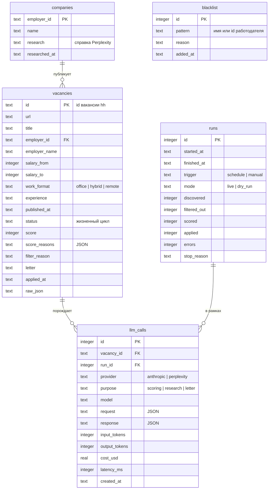

# Database Schema

**СУБД**: SQLite 3 (`better-sqlite3`), файл `~/.hh-agent/state.db`
**Инструмент миграций**: собственный раннер по `PRAGMA user_version` + файлы `db/migrations/V00N__*.sql`
**Соглашение по именованию**: snake_case, таблицы во множественном числе
**Режим**: WAL, `foreign_keys = ON`

---

## ER-диаграмма



---

## Таблицы

### `vacancies`

```sql
CREATE TABLE vacancies (
    id            TEXT PRIMARY KEY,              -- id вакансии hh.ru
    url           TEXT NOT NULL,
    title         TEXT NOT NULL,
    employer_id   TEXT REFERENCES companies(employer_id),
    employer_name TEXT NOT NULL,
    salary_from   INTEGER,
    salary_to     INTEGER,
    currency      TEXT,
    work_format   TEXT CHECK (work_format IN ('office', 'hybrid', 'remote', 'unknown')),
    experience    TEXT,
    published_at  TEXT,
    discovered_at TEXT NOT NULL DEFAULT (datetime('now')),
    status        TEXT NOT NULL DEFAULT 'discovered'
                  CHECK (status IN ('discovered', 'filtered_out', 'scored',
                                    'skipped', 'queued', 'applied', 'failed')),
    score         INTEGER,
    score_reasons TEXT,                          -- JSON: {reasons: [], red_flags: []}
    filter_reason TEXT,                          -- почему отсеяна жёстким фильтром
    letter        TEXT,                          -- финальный текст письма
    applied_at    TEXT,
    raw_json      TEXT,                          -- сырые данные карточки/страницы
    updated_at    TEXT NOT NULL DEFAULT (datetime('now'))
);

CREATE INDEX idx_vacancies_status     ON vacancies (status);
CREATE INDEX idx_vacancies_applied_at ON vacancies (applied_at);
CREATE INDEX idx_vacancies_employer   ON vacancies (employer_id);
```

**Назначение**: реестр всех увиденных вакансий и их жизненный цикл.
Первичный ключ = id hh.ru — гарантия «никогда не откликаемся дважды».

**Жизненный цикл статусов**:
`discovered` → `filtered_out` (жёсткий фильтр) | `scored` → `skipped` (score < порога) | `queued` → `applied` | `failed`.

---

### `companies`

```sql
CREATE TABLE companies (
    employer_id   TEXT PRIMARY KEY,
    name          TEXT NOT NULL,
    research      TEXT,                          -- справка Perplexity (markdown)
    researched_at TEXT
);
```

**Назначение**: кэш рисерча компаний. Справка старше 30 дней считается протухшей
и запрашивается заново (проверка в коде, не в БД).

---

### `llm_calls`

```sql
CREATE TABLE llm_calls (
    id            INTEGER PRIMARY KEY AUTOINCREMENT,
    vacancy_id    TEXT REFERENCES vacancies(id) ON DELETE SET NULL,
    run_id        INTEGER REFERENCES runs(id) ON DELETE SET NULL,
    provider      TEXT NOT NULL CHECK (provider IN ('anthropic', 'perplexity')),
    purpose       TEXT NOT NULL CHECK (purpose IN ('scoring', 'research', 'letter')),
    model         TEXT NOT NULL,
    request       TEXT NOT NULL,                 -- полный JSON запроса
    response      TEXT,                          -- полный JSON ответа (NULL при ошибке)
    error         TEXT,                          -- текст ошибки, если была
    input_tokens  INTEGER,
    output_tokens INTEGER,
    cost_usd      REAL,
    latency_ms    INTEGER,
    created_at    TEXT NOT NULL DEFAULT (datetime('now'))
);

CREATE INDEX idx_llm_calls_vacancy ON llm_calls (vacancy_id);
CREATE INDEX idx_llm_calls_created ON llm_calls (created_at DESC);
CREATE INDEX idx_llm_calls_purpose ON llm_calls (purpose);
```

**Назначение**: полный аудит всех обращений к Claude и Perplexity — отладка промптов,
контроль затрат, воспроизводимость решений агента (требование FR-013).

---

### `runs`

```sql
CREATE TABLE runs (
    id           INTEGER PRIMARY KEY AUTOINCREMENT,
    started_at   TEXT NOT NULL DEFAULT (datetime('now')),
    finished_at  TEXT,
    trigger      TEXT NOT NULL CHECK (trigger IN ('schedule', 'manual')),
    mode         TEXT NOT NULL CHECK (mode IN ('live', 'dry_run')),
    discovered   INTEGER NOT NULL DEFAULT 0,
    filtered_out INTEGER NOT NULL DEFAULT 0,
    scored       INTEGER NOT NULL DEFAULT 0,
    applied      INTEGER NOT NULL DEFAULT 0,
    errors       INTEGER NOT NULL DEFAULT 0,
    stop_reason  TEXT                            -- completed | daily_limit | captcha | logged_out | error_streak | paused
);
```

**Назначение**: журнал сессий пайплайна; источник дневного отчёта (FR-014).
Дневной лимит откликов считается как `SUM(applied)` по `runs` за текущие сутки.

---

### `blacklist`

```sql
CREATE TABLE blacklist (
    id       INTEGER PRIMARY KEY AUTOINCREMENT,
    pattern  TEXT NOT NULL UNIQUE,               -- employer_id или подстрока имени
    reason   TEXT,
    added_at TEXT NOT NULL DEFAULT (datetime('now'))
);
```

**Назначение**: работодатели, на которых не откликаемся. Управляется MCP-инструментами
`blacklist_add` / `blacklist_remove`.

---

## Миграции

```
db/migrations/
  V001__initial_schema.sql
  V002__...
```

1. Только вперёд, rollback запрещён
2. Один файл на изменение; применённые файлы не редактируются
3. Раннер сравнивает `PRAGMA user_version` с номером файла, применяет по порядку в транзакции
4. Обновлять этот документ в том же коммите, что и миграцию

---

## Связанные документы

- Архитектура: [architecture.md](./architecture.md)
- Лог LLM-вызовов в контексте AI: [ai-spec.md](./ai-spec.md)

---

## История изменений

| Дата       | Версия | Автор      | Что изменилось                                                  |
| ---------- | ------ | ---------- | --------------------------------------------------------------- |
| 2026-07-03 | 1.0    | @aleksandr | Первая версия: vacancies, companies, llm_calls, runs, blacklist |
